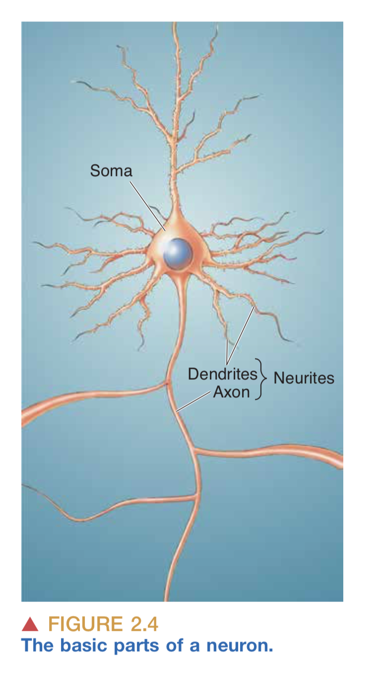

Inspired by silenceinbetween's lovely post [Current Understanding of Biology](https://silenceinbetween.substack.com/p/current-understanding-of-biology), I thought I'd write up a snapshot of my current understanding of neuroscience. Caveat: This will be written mostly off the top of my head, so excuse any typos or nonsequiturs.

I started "studying neuroscience" a few years ago, as in, I began reading an intro textbook a few years ago. I wrote about it early on in [A foray into neuroscience](https://bitsofwonder.substack.com/p/a-foray-into-neuroscience) and more recently in [Textbooks as a preventative for depression](https://bitsofwonder.substack.com/p/textbooks-as-a-preventative-for-depression), although the latter is more about the motivation behind reading a textbook.

So, what's the deal with tbe brain? It contains about a hundred billion neurons, and neurons connect to each other via synapses. Each neuron has a cell body, dendrites which take input, and an axon which produces output. 

A note about anatomy which confused me at first: while the cell body projects into _one_ axon, that axon can subsequently branch. That's why we say the neuron has _one_ axon even though it may project on multiple neurons. (Even this point I'm not entirely sure about, tbh.) Dendrites, on the other hand, are present aplenty in each neuron, sometimes in the thousands. 

This is all well and good, except for the fact that there is this whole other category of cells in the brain called _glia_, and we're not 100% sure about what glia do. Some kind of peripheral support / cleanup role, perhaps? Or maybe they're actually very important.

This is also related to [AI discourse](notes/ai-discourse.md).